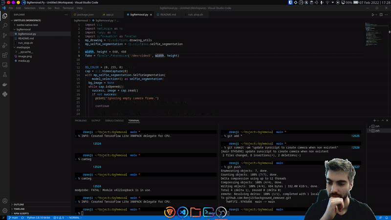

# Background Remove
Removes Background rom Webcam image for any cam service.

## Demo



# Requirements
For the script to work you need to be able to create a loopback camera first.

```
sudo apt install v4l2loopback-dkms

sudo modprobe -r v4l2loopback
sudo modprobe v4l2loopback devices=1 video_nr=5 card_label="v4l2loopback" exclusive_caps=1
```

The script itself depends on
`cv2` , `mediapipe`, `numpy` and `pyfakewebcam`.

# Run
Just run `run_stop.sh` to run to start it and again `run_stop.sh` to turn it off again.
While running you just have to select the newly created camera as the webcam. In obs you can then apply a green color filter to remove the background.